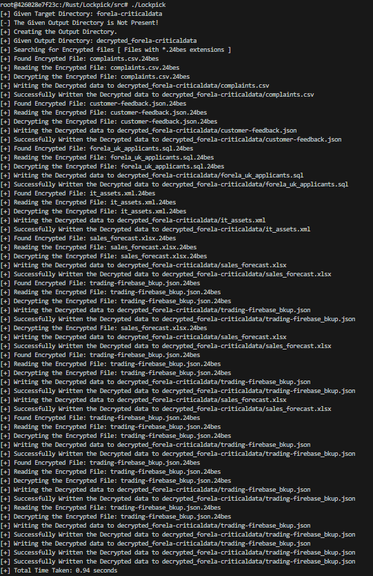

# Lockpick

## Sherlock Scenario

Forela needs your help! A whole portion of our UNIX servers have been hit with what we think is ransomware. We are refusing to pay the attackers and need you to find a way to recover the files provided. Warning This is a warning that this Sherlock includes software that is going to interact with your computer and files. This software has been intentionally included for educational purposes and is NOT intended to be executed or used otherwise. Always handle such files in isolated, controlled, and secure environments. Once the Sherlock zip has been unzipped, you will find a DANGER.txt file. Please read this to proceed.



***

## Setting up the Environment

First download the given file and extract it. The password for the given zip file is `hacktheblue`.

<figure><figcaption></figcaption></figure>

The given zip file has another zip file and a `DANGER.txt` file as shown in the following image.

<figure><figcaption></figcaption></figure>

The `DANGER.txt` file contains the password for the `bescrypt.zip` file.

<figure><figcaption></figcaption></figure>

The password for `bescrypt.zip` file is `E@iwyzXK7HK&`.

<figure><figcaption></figcaption></figure>

***

## Task 1

### Question

Please confirm the encryption key string utilised for the encryption of the files provided?

### Solution

First lets check the file type using the `file` command.

<figure><figcaption></figcaption></figure>

The given file is a ELF `64-bit` executable. Next open the `bescrypt3.2` binary file in Ghidra to view the disassembled code. You can use a disassembler of your choice.

<figure><figcaption></figcaption></figure>

As show in the above image, the `main` function calls another function `process_directory` with folder name and encryption key as the arguments.

**Answer:** `bhUlIshutrea98liOp`

***

## Task 2

### Question

We have recently recieved an email from [wbevansn1@cocolog-nifty.com](mailto:wbevansn1@cocolog-nifty.com) demanding to know the first and last name we have him registered as. They believe they made a mistake in the application process. Please confirm the first and last name of this applicant.

### Solution

Next if we take a look at the decompiled version of the `process_directory` function, it checks whether the directory name that is passed as the argument is valid and if it is a valid directory it looks out for files with one of the following extensions: `.txt, .sql, .pdf, .docx, .xlsx, .csv, .json, .xml`.

<figure><figcaption></figcaption></figure>

If any files with the extension from the above list is found, it calls another function `encrypt_file` with the encryption key and file name as the argument.

Next let's take a look at the `encrypt_file` function.

<figure><figcaption></figcaption></figure>

I have modified a few variable names from the above image for easy understanding. If you want you can also modify the variable names by selecting anyone of the instance of the variable name and clicking the `L` key ( just `L` ) to open the dialog box. If you change the variable name at anyone of the instance Ghidra will automatically modify all the instances.

Here is the list of variables that I have changed:

```
local_28 -> file
param_1 -> filename
param_2 -> key
ftell -> current_value_file_pos
local_38 -> allocated_memory
local_20 -> i
sVar4 -> key_len
uVar2 -> i_
bVar1 -> byte
```

The `encrypt_file` function, reads the file as bytes that is given in the parameter and performs `XOR` operation on each byte with on of the characters from the encryption key and writes the encrypted output to a file with filename as `<original_filename_with_extension>.24bes`.

```
# XOR Operation that is performed on each byte of the file
byte XOR key[ i % key_length ]

# Here, 'i' is a counter that is incremented by 1, It has the initial value as 0
```

You can see the `XOR` operation in the following image.

<figure><figcaption></figcaption></figure>

Thus, the given binary encrypts all the files with a basic `XOR` encryption algorithm.

I have written a python script that loops through all the encrypted files in the given directory and decrypts them and stores the decrypted file in a separate directory.



```python
import os
from re import match
import time


def main():
    target_directory = "forela-criticaldata"
    output_directory = f"decrypted_{target_directory}"
    key = "bhUlIshutrea98liOp"
    key_len = len(key)

    if not os.path.isdir(target_directory):
        print("[-] The Given Target Directory is Not Present!")
        exit()
    else:
        print(f"[+] Given Target Directory: {target_directory}")

        if not os.path.isdir(output_directory):
            print("[-] The Given Output Directory is Not Present!")
            print("[+] Creating the Output Directory.")
            os.mkdir(output_directory)

        print(f"[+] Given Output Directory: {output_directory}")
        print("[+] Searching for Encrypted files [ Files with *.24bes extensions ]")

        for root, _, files in os.walk(target_directory):
            for file in files:
                # Checking whether the file is a encrypted file by looking out for *.24bes extension
                if match(r"^.+\.24bes$", file):
                    print(f"[+] Found Encrypted File: {file}")
                    print(f"[+] Reading the Encrypted File: {file}")

                    with open(os.path.join(root, file), 'rb') as encrypted_file:
                        encrypted_bytes = encrypted_file.read()

                    decrypted_bytes = bytearray()

                    print(f"[+] Decrypting the Encrypted File: {file}")
                    for i, byte in enumerate(encrypted_bytes):
                        decrypted_bytes.append(byte ^ ord(key[i % key_len]))

                    decrypted_file_name = f"{output_directory}/{file[:-6]}"

                    print(f"[+] Writing the Decrypted data to {decrypted_file_name}")
                    with open(decrypted_file_name, 'wb') as decrypted_file:
                        decrypted_file.write(decrypted_bytes)
                    
                    print(f"[+] Successfully Written the Decrypted data to {decrypted_file_name}")


if __name__ == "__main__":
    start_time = time.perf_counter()
    main()
    end_time = time.perf_counter()
    print(f"[+] Total Time Taken: {end_time - start_time} seconds")
```



```rust
// Will be Added
```



The above python script ran successfully as shown in the following image.

<figure><figcaption></figcaption></figure>

It took around 9 seconds for the script to decrypt the files and you can see all the decrypted files are stored in a separated directory named `decrypted_forela-criticaldata` as shown in the following image.

<figure><figcaption></figcaption></figure>

We have successfully decrypted all the files. Next I used the `grep` command to search for the given email [wbevansn1@cocolog-nifty.com](mailto:wbevansn1@cocolog-nifty.com) in all the decrypted files as shown in the above image.

**Answer:**  `Walden Bevans`

***

## Task 3

### Question

What is the MAC address and serial number of the laptop assigned to Hart Manifould?

### Solution

The `it_assets.xml` file contains all the information about assets owned by the people. The `it_assets.xml` file has the `XML` content in a minified/compressed format. I used `CyberChef` to beautify the XML code as shown in the below image.

<figure><figcaption></figcaption></figure>

After downloading the beautified version of the `it_assets.xml` file, I opened it with `VScode` and used the find feature to filter the results.

<figure><figcaption></figcaption></figure>

Successfully found the information related to assets of Hart Manifould as shown in the above image.

**Answer:** `E8-16-DF-E7-52-48, 1316262`

***

## Task 4

### Question

What is the email address of the attacker?

### Solution

The attacker has left a note for each file that was encrypted.

<figure><figcaption></figcaption></figure>

All the notes contains the email of the attacker as shown in the above image.

**Answer:** `bes24@protonmail.com`

***

## Task 5

### Question

City of London Police have suspicions of some insider trading taking part within our trading organisation. Please confirm the email address of the person with the highest profit percentage in a single trade alongside the profit percentage.

### Solution

To find the details of the person with the highest profit percentage in a single trade, I used the `jq` command in combination with the `grep` command, to sort and filter out the json data from the `trading-firebase_bkup.json` file and extract the details. The command I used is as follows:


```bash
jq '[.[]] | sort_by(.profit_percentage) | .[-1] | (.profit_percentage)' trading-firebase_bkup.json | xargs -I pp grep pp trading-firebase_bkup.json
```


The above command worked correctly and extracted the details of the person as shown in the following image.

<figure><figcaption></figcaption></figure>

**Answer:** `fmosedale17a@bizjournals.com, 142303.1996053929628411706675436`

***

## Task 6

### Question

Our E-Discovery team would like to confirm the IP address detailed in the Sales Forecast log for a user who is suspected of sharing their account with a colleague. Please confirm the IP address for Karylin O'Hederscoll.

### Solution

This data is available in the `sales_forecast.xlsx` file. To view the `XLSX` file, I used the following online `XLSX` viewer: [https://products.aspose.app/cells/viewer/xlsx](https://products.aspose.app/cells/viewer/xlsx)

<figure><figcaption></figcaption></figure>

We can find the IP address  of Karylin as shown in the above image.

**Answer:** `8.254.104.208`

***

## Task 7

### Question

Which of the following file extensions is not targeted by the malware? `.txt, .sql,.ppt, .pdf, .docx, .xlsx, .csv, .json, .xml`

### Solution

The given only binary checks for the extensions that is shown in the decompiled view of the Ghidra disassembler.

<figure><figcaption></figcaption></figure>

**Answer:** `.ppt`

***

## Task 8

### Question

We need to confirm the integrity of the files once decrypted. Please confirm the MD5 hash of the applicants DB.

### Solution

You can get the MD5 hash of the `forela_uk_applicants.sql` file using the following command.

```bash
md5sum forela_uk_applicants.sql
```

<figure><figcaption></figcaption></figure>

**Answer:** `f3894af4f1ffa42b3a379dddba384405`

***

## Task 9

### Question

We need to confirm the integrity of the files once decrypted. Please confirm the MD5 hash of the trading backup.

### Solution

You can get the MD5 hash of the `trading-firebase_bkup.json` file using the following command.

```bash
md5sum trading-firebase_bkup.json
```

<figure><figcaption></figcaption></figure>

**Answer:** `87baa3a12068c471c3320b7f41235669`

***

## Task 10

### Question

We need to confirm the integrity of the files once decrypted. Please confirm the MD5 hash of the complaints file.

### Solution

You can get the MD5 hash of the `complaints.csv` file using the following command.

```bash
md5sum complaints.csv
```

<figure><figcaption></figcaption></figure>

**Answer:** `c3f05980d9bd945446f8a21bafdbf4e7`
